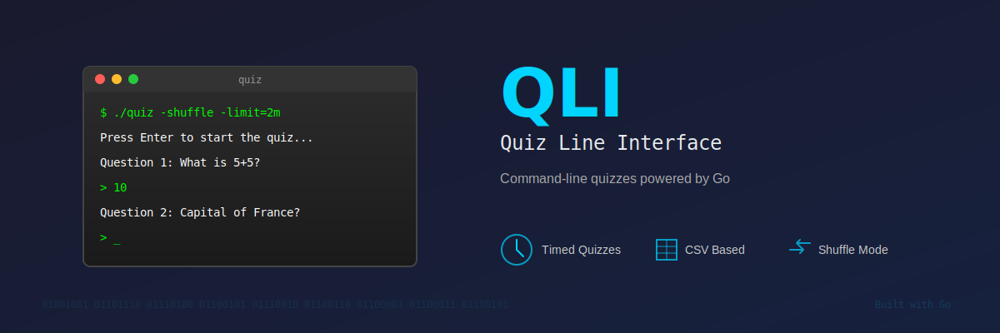

<p align="center">
  
</p>
<h1 align="center"><i>QLI - Quiz Line Interface</i></h1>

<p align="center">
  <a href="https://go.dev">
    
  </a>
  <a href="https://github.com/Nostromos/qli">
    
  </a>
  <a href="https://gophercises.com">
    
  </a>
</p>

## Overview

A command-line quiz application written in Go that reads questions from CSV files and challenges users against a timer. Built as part of the [Gophercises](https://gophercises.com/) exercise series by Jon Calhoun.

## Features

- **CSV-based Questions**: Load quiz questions from CSV files
- **Timed Quizzes**: Set custom time limits for completing the quiz
- **Question Shuffling**: Randomize question order for variety
- **Clean Interface**: Simple, intuitive command-line interface
- **Score Tracking**: Displays final score upon completion
- **Flexible Answer Matching**: Case-insensitive with whitespace normalization

## Requirements

- Go 1.23.0 or higher

## Installation

1. Clone the repository:
```bash
git clone https://github.com/Nostromos/gophercises.git
```
```bash
cd gophercises/quiz
```

2. Build the application:
```bash
go build -o quiz quiz.go
```

Or run directly without building:
```bash
go run quiz.go
```

## Usage

### Basic Usage

Run the quiz with default settings (30-second timer, questions.csv file):
```bash
./quiz
```

### Command-Line Options

```bash
./quiz [options]
```

| Flag       | Description                                 | Default           |
| ---------- | ------------------------------------------- | ----------------- |
| `-csv`     | Path to CSV file containing questions       | `./questions.csv` |
| `-limit`   | Time limit for the quiz (e.g., 30s, 1m, 1h) | `30s`             |
| `-shuffle` | Shuffle questions randomly                  | `false`           |

### Examples

```bash
# Use a custom questions file
./quiz -csv=myquestions.csv
```
```bash
# Set a 1-minute time limit
./quiz -limit=1m
```
```bash
# Shuffle questions for variety
./quiz -shuffle
```
```bash
# Combine all options
./quiz -csv=advanced.csv -limit=2m -shuffle
```

## CSV File Format

Questions must be in a CSV file with exactly 2 columns:
- **Column 1**: Question text
- **Column 2**: Answer

### Example CSV:
```csv
5+5,10
What is the capital of France?,paris
What year was Go released?,2009
```

**Note**: The CSV parser properly handles questions containing commas.

### Sample Files Included:
- `questions.csv` - Default basic math questions
- `math.csv` - Additional math problems
- `trivia.csv` - General trivia questions

## How It Works

1. **Start**: Press Enter to begin the quiz and start the timer
2. **Questions**: Each question is displayed one at a time
3. **Answers**: Type your answer and press Enter to continue
4. **Timer**: The quiz ends when time runs out or all questions are answered
5. **Score**: Final score is displayed as "X out of Y questions correct"

## Answer Matching

Answers are matched with the following rules:
- Case-insensitive (e.g., "Paris" matches "paris")
- Leading/trailing whitespace is ignored
- Exact match required after normalization

## Development

### Running Tests

```bash
go test
```

### Project Structure

```
quiz/
├── quiz.go              # Main application code
├── quiz_test.go         # Test suite
├── questions.csv        # Default questions file
├── math.csv             # Math questions
├── trivia.csv           # Trivia questions
├── qli-header-image.svg # Header image
├── docs/                # Documentation
│   ├── API.md           # API documentation
│   ├── EXAMPLES.md      # Usage examples
│   └── THOUGHTS.md      # Development notes
├── go.mod               # Go module file
└── README.md            # This file
```

## Contributing

1. Fork the repository
2. Create your feature branch (`git checkout -b feature/amazing-feature`)
3. Commit your changes (`git commit -m 'Add some amazing feature'`)
4. Push to the branch (`git push origin feature/amazing-feature`)
5. Open a Pull Request

## License

See [LICENSE](./LICENSE) for more information.

## Acknowledgments

This project is part of the [Gophercises](https://gophercises.com/) exercise series by Jon Calhoun.

## Additional Resources

- [Documentation](./docs/) - API reference and examples
- [Gophercises](https://gophercises.com/) - Complete exercise series
- [Go Documentation](https://go.dev/doc/) - Official Go documentation